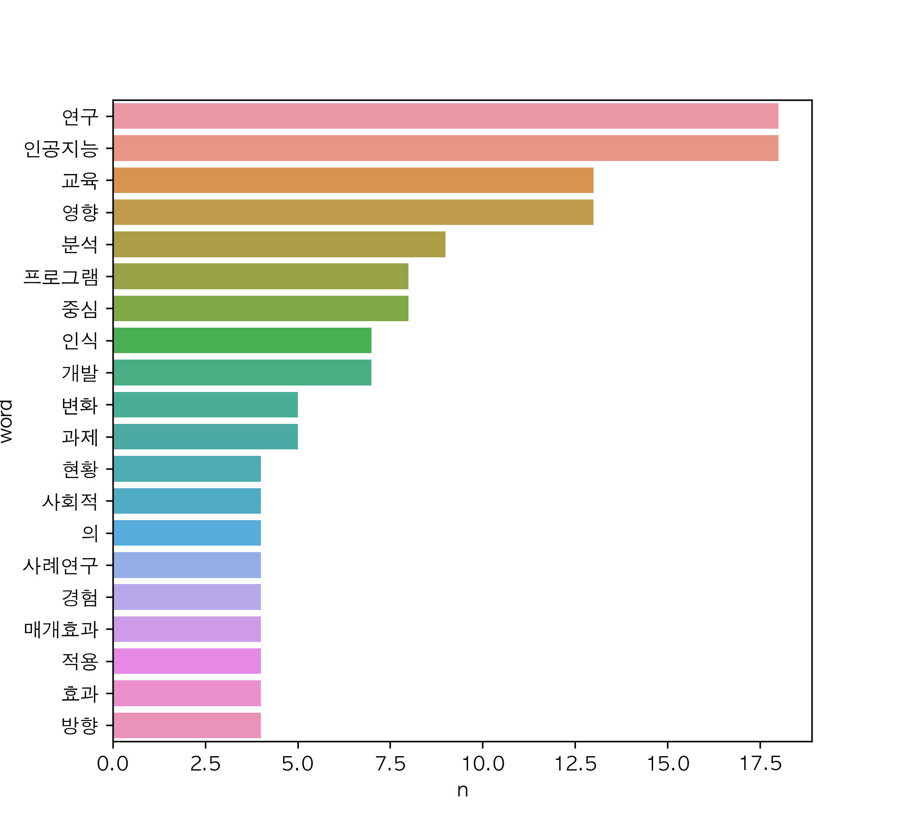

# Riss_Popular_thesis_wordCloud

Riss 에서 제공하는 인기 학술 자료의 데이터를 사용하였다.  
http://www.riss.kr/PopularList.do  

상단의 기간 변경을 기준으로 데이터를 추출하는 것으로 진행중이며  
해당 페이지의 99개의 자료를 크롤링 하여 텍스트 파일로 저장,    
저장된 텍스트 파일을 가공하여 워드클라우드로 생성한다.  

|일자|변경내용|
|--|-----|
|2023.02.12|csv, barplot, wordcloud가 자동으로 저장될 수 있도록 수정|

### 2023.1.8~2023.2.4

### 2023.1.15~2023.2.11

### 2023.1.22~2023.2.18

### 2023.1.29~2023.2.25

### 2023.2.12~2023.3.11

### 2023.2.19~2023.3.18

### 2023.2.26~2023.3.25

### 2023.3.5~2023.4.1

### 2023.3.12~2023.4.8

### 2023.3.19~2023.4.15

### 2023.3.26~2023.4.22

### 2023.4.2~2023.4.29

### 2023.4.9~2023.5.6

### 2023.4.16~2023.5.13

### 2023.4.23~2023.5.20

### 2023.4.30~2023.5.27

### 2023.5.7~2023.6.3

### 2023.5.14~2023.6.10

### 2023.5.21~2023.6.17

